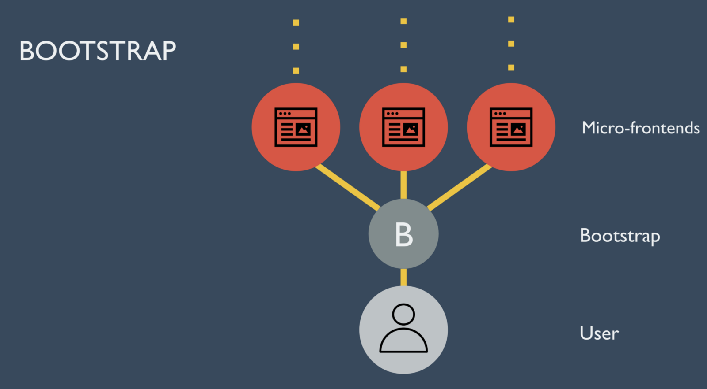

export { default as theme } from './theme'
import Container from './container'

## React 🇳🇱 wrap up

---

### About me

<b>Frontend engineer at Rexlabs</b>

<b>went to React Amsterdam in April</b>

<b>Twitter:</b>  <a style={{ textDecoration: 'none' }} href="https://twitter.com/nik_the_dev">@nik_the_dev</a>

  
  

---

### 1. Design systems

---

### What is a design system?
- A Langauge
- A foundation, set of primitives, and set of patterns
- A way of Reducing choice in building blocks
 <!-- (typography, color, spacing) -->

---

### Cool takeaways
- We can use simplified react to bridge the gap between design/FE development

---

  
  

---

### A lot of links
- https://airbnb.design/building-a-visual-language/
- https://component-driven.github.io/component-driven-development/styleguide

- https://medium.com/seek-blog/sketching-in-the-browser-33a7b7aa0526
- https://airbnb.design/painting-with-code/

- https://github.com/seek-oss/braid-design-system
- https://github.com/seek-oss/playroom

---

### 2. SSR

---

### What is SSR?

- Rendering the page on the server and sending a fully rendered page to the client
- Try it out with `Next.js`
<!-- Max Stoiber regrets not using Next.js for spectrum -->

---

### Cool takeaways

- Becoming trememdously popular

- Can be a HUGE performance win
  - Companies (like Netflix) using SSR for huge performance wins
   <!-- getting +50% perceived perf by removing all client side react -->

- https://nextjs.org
- https://github.com/esxjs/esx

---

### 3. Micro frontends

---

### What are micro-frontends
- Solving the problem of colaborating on large frontends

- **Spotify:** Many iframes rendered on the page which communicate with an in-house event bus
<!-- although they're moving to a react-redux solution so we'll see what they do with that  -->
- **SkyScanner/OpenTable:** https://opencomponents.github.io/

---

### Cool takeaways ft. DAZN

- 1 micro frontend loaded at a time
- no shared dependencies between micro frontends
- 1 micro frontend per business domain

- Request flow
    - Bootstraper loads first
    - retrieves some config from the API
    - resolves micro-frontend based on request/url/whatever
    - mounts the micro-frontend with config

- https://medium.com/dazn-tech/adopting-a-micro-frontends-architecture-e283e6a3c4f3

---

  

---

<h3 style={{ marginLeft: '-80px', display: 'flex', alignItems: 'center'}}>GraphQL 
</h3>

---

### Workshop
- serving graph-ql is a piece of cake
  - prisma/graphql-yoga
  - graphpack

- consuming graqh-ql is a piece of cake too
  - react-apollo-boost
  - react-apollo-hooks

---

### Conference talk by Apollo

- 2019 will be about DX for apollo
- better TS support (apollo-cli can already auto-gen TS based on GQL schema)
- better suggestions (i.e. for query perf)

  

---

### Fundamentals

---

- You should understand your abstractions

https://github.com/kentcdodds/requisite-react

- How to write better react

https://sid.studoi/refactoring

<!-- - components should take props which handle behaviour not interaction
- components should do as little as possible and do it well, delegate up if you can
- if some logic isn't core to a feature, put it in a HOC or hook -->

<!-- - When designing an app which is mobile first/web for support, max stoiber says use react-native-web -->

---

### Open source libraries
- https://github.com/wilk/microjob
- https://github.com/hshoff/vx
- https://github.com/diegohaz/constate
- https://github.com/rstacruz/remount

---

### Slides 
https://github.com/NikChao/react-amsterdam-wrapup-talk